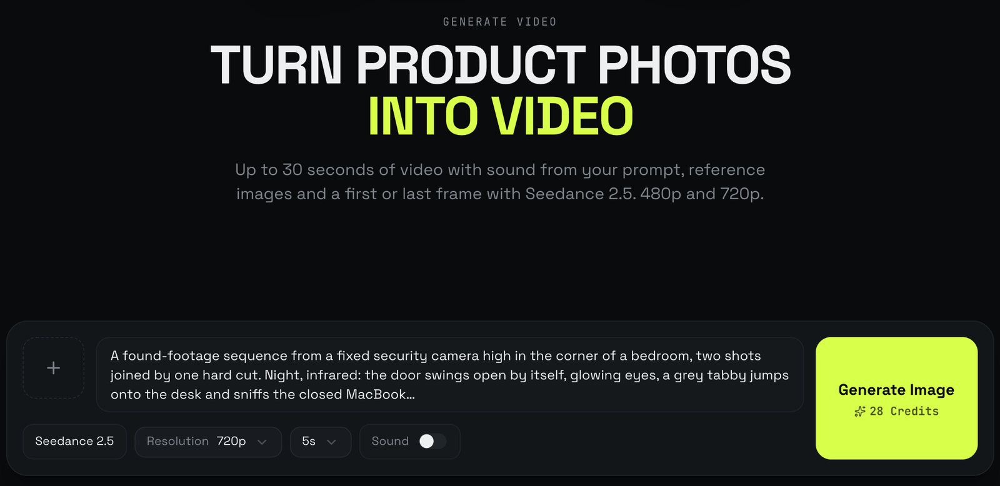

# Claude reel skills

Two [Claude skills](https://docs.claude.com/en/docs/claude-code/skills) for making short product reels (Instagram Reels, TikTok, YouTube Shorts). AI-generated footage carries the action, and a motion layer rendered from code carries the product.

| Skill | Job | In | Out |
|---|---|---|---|
| [`reel-taste`](skills/reel-taste) | Idea to script, with taste | a product and what it does | a concept, a video-model prompt, motion notes, a caption |
| [`motion-studio`](skills/motion-studio) | Script to finished film | a generated take and the motion notes | a 1080x1920 MP4 with the real UI, type, sound and an end card |

They are built to be used together, and each one refers to the other. **reel-taste** decides *what* the video is and writes a prompt a video model can render, plus motion notes the edit can hold on to. **motion-studio** takes that package as its brief and *executes* it: it tracks the product's real UI onto screens, animates type on springs, scores the sound on the same timeline, and critiques its own frames until they pass. Either one works alone, but the handoff between them is the point.

```
 product ──► reel-taste ──► video prompt ──► Loomshot (Seedance 2.5) ──► take.mp4
                 │                                                          │
                 └──────────── motion notes ────────► motion-studio ◄───────┘
                                                            │
                                                            ▼
                                                    reel.mp4 (+ score, QC)
```

## reel-taste: ideas and scripts with taste

A creative director for reels whose footage is generated from a prompt. It finds the product's *verb*, the one thing it makes possible, and puts that verb at the turning point of a story. It spreads ideas across genres and devices on purpose, so you don't get the same recipe twice, and it holds every idea to a taste bar: it reads in one second with the sound off, the details are specific rather than hype, there is one signature move, the footage looks real rather than CG, and the claims are honest.

For the chosen idea it delivers:
- a single multi-shot prompt the video model can render consistently (timestamped actions, consistency anchors, cuts placed where an edit can hide them, an AVOID line);
- motion notes as a `time | picture | on screen | sound` table, with the signature move, the safe zones and where the CTA goes;
- what to check in the generated take before editing, and a caption.

Those motion notes are exactly the brief **motion-studio** expects. See [`skills/reel-taste`](skills/reel-taste).

## motion-studio: the motion layer, rendered from code

A film here is a program: an HTML page with `window.renderAt(t)` that paints the exact frame for any moment. Headless Chromium renders it frame by frame and ffmpeg encodes it. Because every frame is a pure function of time, any fix is an edit plus a re-render, and Claude can look at any frame it made.

What the pipeline does:
- **Ingest:** reads the take and makes a labelled contact sheet, plus the cuts, dark runs and audio profile.
- **Retime:** puts story beats on a grid, with speed ramps (shutter blend) and slow motion (interpolated frames).
- **Screen replacement:** tracks screens (LK flow + RANSAC, hand-marked quads for fast swings) and cuts out hands so fingers stay in front of the UI.
- **Motion:** closed-form springs, velocity-matched seams, kinetic type, a HUD, and real UI at a real size.
- **Sound:** synthesized score and sound design with perspective, vacuums and tape-stops, mixed to −15 LUFS.
- **Delivery:** motion blur from subframes; on Apple Silicon the Apple Media Engine (VideoToolbox) encodes automatically.
- **Critique:** a loop over the rendered frames (contact sheets, strips around cuts, phone-size pass, safe-zone overlay, centring measured in pixels) that scores 1–10 and keeps fixing until every score is 8+.

It takes **reel-taste**'s package as its brief. Without one, it writes the motion notes itself first. It asks which language the on-screen copy should be in when the brief doesn't say. See [`skills/motion-studio`](skills/motion-studio).

## The footage: generated with Loomshot



The takes behind these reels were generated on **[Loomshot](https://loomshot.ai)**, my AI image and video platform for products. It offers GPT Image 2.5, Nano Banana and Seedance 2.5 in one account, plus batch generation, mannequins and ready-made models. Its **Generate Video** page runs Seedance 2.5 and makes up to 30 seconds of video with sound, from a prompt, reference images, or a first or last frame, at 480p or 720p.

That is where reel-taste's prompt goes, and the take it returns is what motion-studio works on. Loomshot also has an MCP server (`https://loomshot.ai/mcp`), so Claude can start a generation from the same chat.

Neither skill depends on Loomshot: any text-to-video model works, and motion-studio will take any clip you give it.

## Why we built them, and what they're based on

We make promo reels for [Lidlezz](https://lidlezz.app), a macOS app that keeps a Mac awake with the lid closed while Claude Code works and lets it sleep when the work is done. The first attempts showed two failure modes:
- **Generic motion:** centred text on a gradient, everything fading in, a logo at the end.
- **One template, repeated:** once "extreme location + laptop + close the lid" worked, every idea started to look like it.

We wanted a repeatable studio that avoids both, so the work is split into taste (reel-taste) and craft (motion-studio).

**Sources:**
- **[How to build motion design studio with Opus 5.5 (Full-course)](https://x.com/0xMovez/status/2104216919033192746)** by Movez ([@0xMovez](https://x.com/0xMovez)), 27 Sep 2026. The backbone of motion-studio comes from here:
  - a deterministic `seek(t)` renderer (a page, Playwright and ffmpeg, no framework);
  - closed-form springs, with one spring per target change so any frame renders on its own;
  - sound synthesized on the picture's timeline and a beat grid;
  - the critique loop that scores stills until everything is 8+;
  - the director's-brief skeleton and "package the pipeline as a skill";
  - generate-then-trace: a video model renders the physical action and code draws the layer the viewer reads.
- **[HyperFrames](https://github.com/heygen-com/hyperframes)** by HeyGen (Apache-2.0). Its `motion-doctrine`, `cut-the-curve`, `seam-craft` and `oversized-cursor` agent skills shaped `references/doctrine.md`:
  - the vector law for seams (exit on power4-in, enter on power4-out, cut mid-motion);
  - carriers across cuts, one dominant direction, and no idle wobble;
  - springs instead of easing curves, and the oversized-cursor move.
  - We adapted the ideas in our own words and code; no HyperFrames code is included.
- **[claude-animation-skill](https://github.com/buildwithhanif/claude-animation-skill)** by buildwithhanif (MIT). From it we took the habit of looking: contact sheets and 12-frame strips around fast moments (`qc.py sheet` / `strip`), and sound synthesized from the same timeline as the picture.
- **Also studied, not used directly:** [PDoomVideo](https://github.com/JohnHeibel/PDoomVideo), [ClaudeAnimationBase](https://github.com/JohnHeibel/ClaudeAnimationBase), [Battle-of-Austerlitz-Film](https://github.com/WinterArc21/Battle-of-Austerlitz-Film), [awesome-ai-motion](https://github.com/guanmo-ai/awesome-ai-motion) and [awesome-opus-5-5-videos](https://github.com/athemeroy/awesome-opus-5-5-videos).
- **reel-taste** comes from our own production of the Lidlezz reels: what landed, what flopped and why (see its [case studies](skills/reel-taste/references/case-studies.md)). It was written and tested with Anthropic's [skill-creator](https://github.com/anthropics/skills/tree/main/skills/skill-creator), with eval prompts run with and without the skill.

## Install

For Claude Code, copy the skills into your user skills folder (every project) or into a project's `.claude/skills/`:

```bash
git clone https://github.com/witcharon/claude-reel-skills
cp -r claude-reel-skills/skills/reel-taste claude-reel-skills/skills/motion-studio ~/.claude/skills/
```

New sessions pick them up automatically. Ask for reel ideas or hand over a take and the right skill triggers, or call it by name (`/reel-taste`, `/motion-studio`).

reel-taste needs nothing else. motion-studio renders on your machine and needs:
- **ffmpeg**
- **Python 3.10+** with `numpy scipy opencv-python-headless pillow`
- **Node 18+** with `playwright-core @fontsource-variable/inter @fontsource/jetbrains-mono` in the film folder (or a parent folder)
- a Chromium from `npx playwright install chromium`, or Google Chrome

On Apple Silicon it encodes with VideoToolbox and falls back to libx264 elsewhere.

## Try it

```
Give me 5 reel ideas for <product>. It <what it does>. Audience: <who>, on Instagram.
Write the prompt and motion notes for idea 3.
Here's the take: ./take.mp4. Do the motion from the notes above.
```

## License

MIT, see [LICENSE](LICENSE). Credits for the ideas we adapted are in [NOTICE.md](NOTICE.md).
